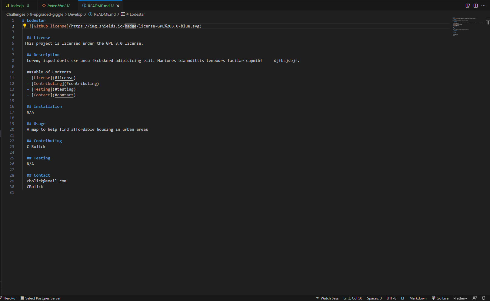

## Upgraded-giggle-09
Challenge 09 

## Description
This is a program that is utilized in a terminal's command line.
Once the program is started, you will be prompted with a series of questions.
After answering all the questions, the program will create a README file.
You should see a README in your files.

## Installation

You will need to import inquirer and nodes before running the app.
As shown in the video, you will us this app all within a terminal window. Once you have installed all the nessecary programs you can run the app.
Once all the prompts have been answered a README.md will be generated using the info the user has submittied.

## Usage

This application will help you to draft up a mock README.md without the users having to set up the formatting first. The user can then go into the newly generated README.md and format it to whatever they see fit.

Credit
Catherine Bolick : https://github.com/C-Bolick

## License

N/A

https://drive.google.com/file/d/126YCTpC9iXsZb4NGfesJO2C1y3vIRky3/view